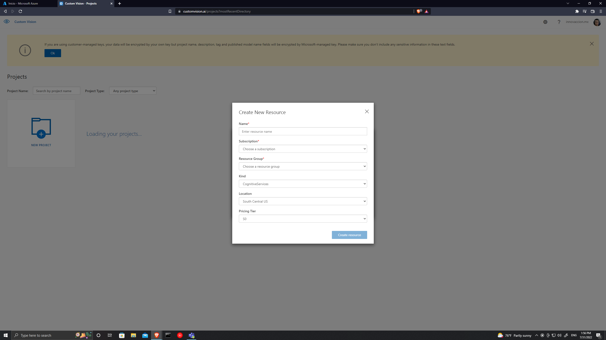
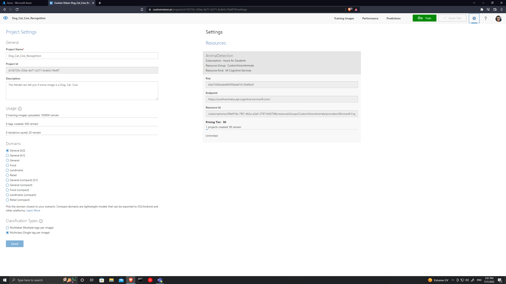
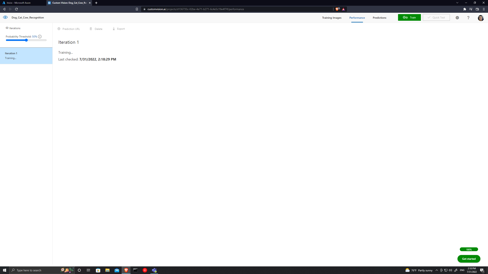
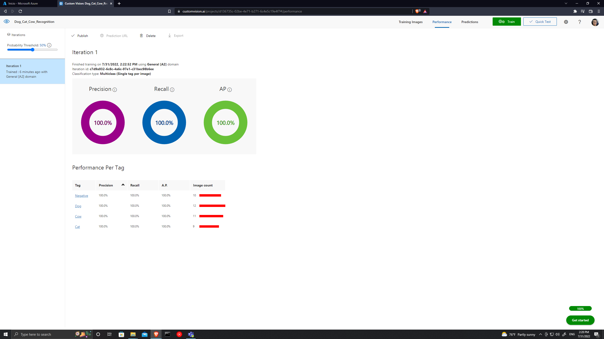
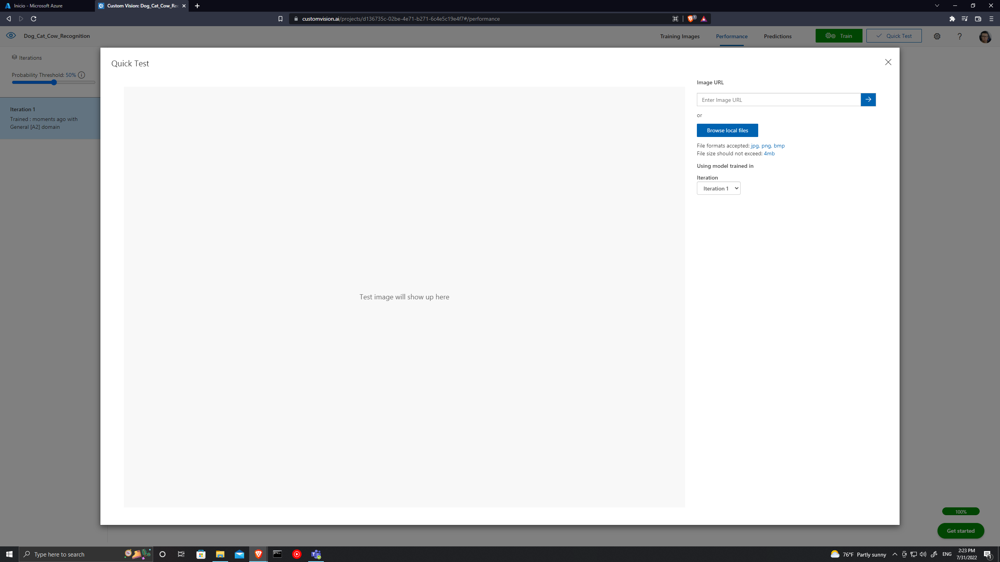
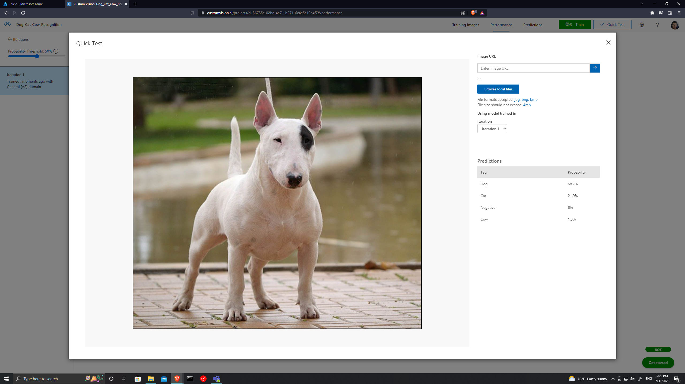
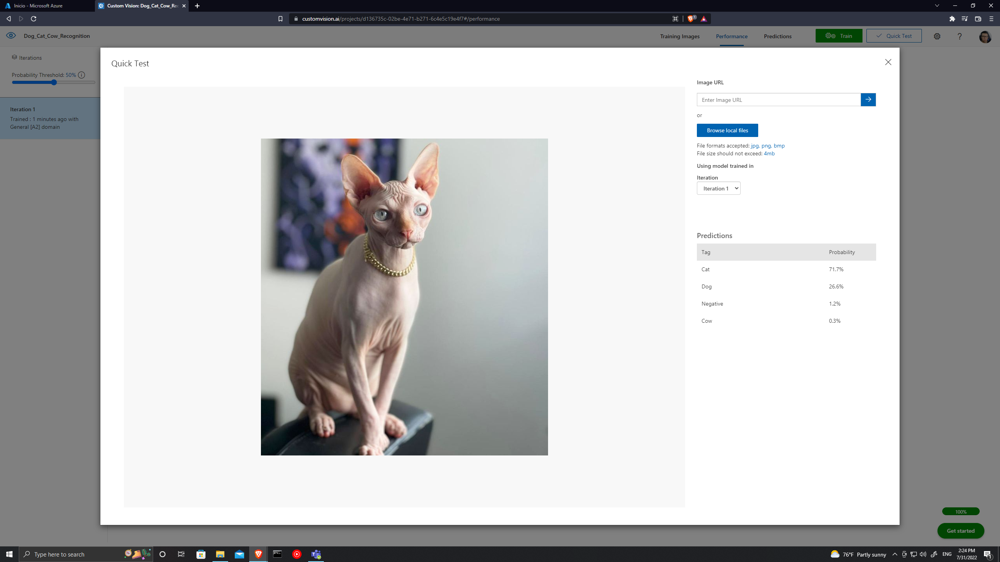
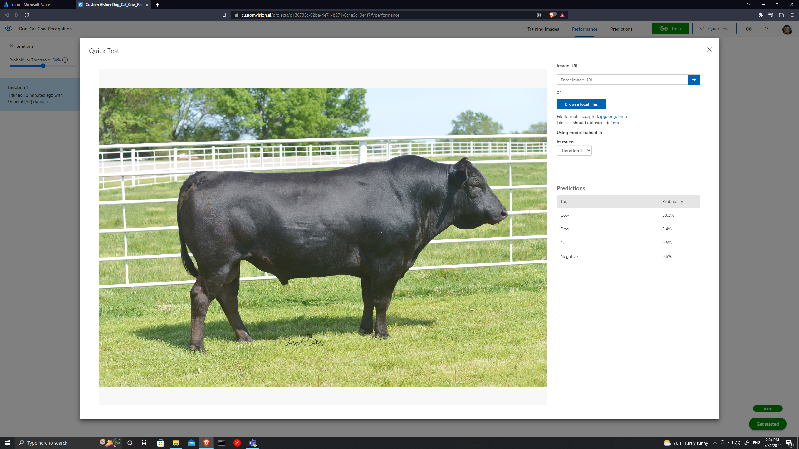

# Azure Custom Vision Dog-Cat-Cow recognition model evidence
We will train a model to recognize between cows, dogs and cata.\
Let us go to customvision.ai, we acces with our account with an Azure subscription and in Projects we create a new project, with name, description and resource.
\
\
For this we will need to create a select a resource, in this case we create one, with name, the Azure subscription, a resource group, kind of service, the location and the pricing.

\
\
I used this configuration for this model.

\
\
Now we wil need to load the images, especifying the tag of each group of animal, and a group of pictures that are the control.

\
\
My image set looks like this.

\
\
It is time to train the model, and it starts to train with the data set that we have loaded.

\
\
Once the training is done the following panel will be shown to us.

\
\
And the model is ready to predict with new inputs.
\
\
For a dog.
\
\
For a cat.

\
\And finally for a cow,
